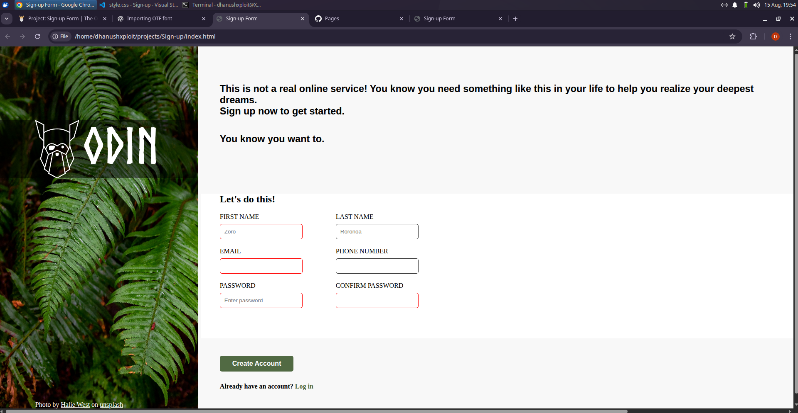

# Sign-up Form

A simple and responsive sign-up form built using **HTML** and **CSS** only.  
This project is part of a learning exercise to practice form design, layout, and styling without using JavaScript.

---

## 📌 Features
- Clean and minimal design
- Fully responsive layout
- HTML5 form validation
- CSS-only styling
- Works across modern browsers

---

## 🛠️ Technologies Used
- **HTML** – For structure and semantic markup
- **CSS** – For styling and layout

---

📸 Preview
 

🖊 Author

DhanushXploit
📚 Guided by The Odin Project

